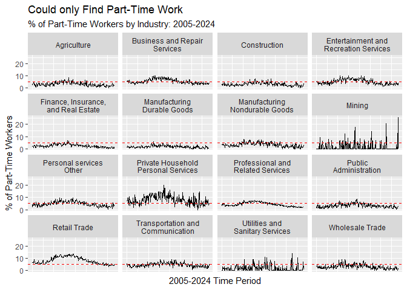
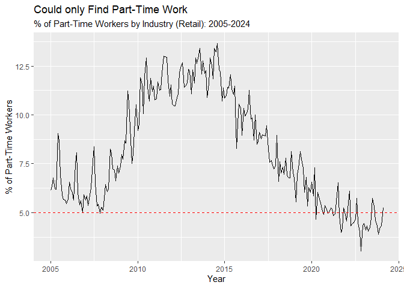
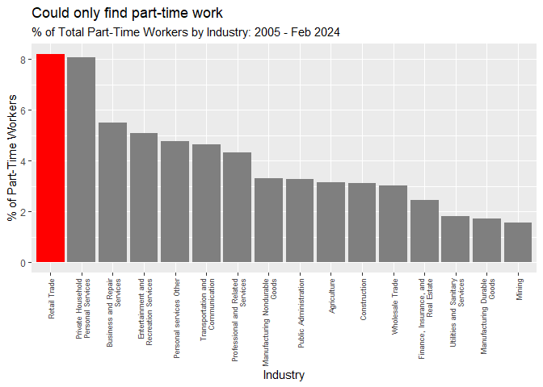
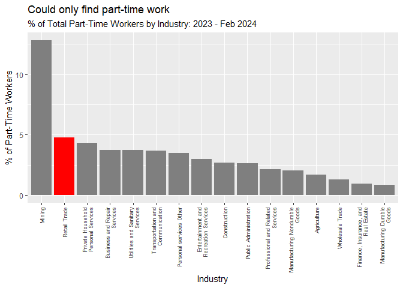
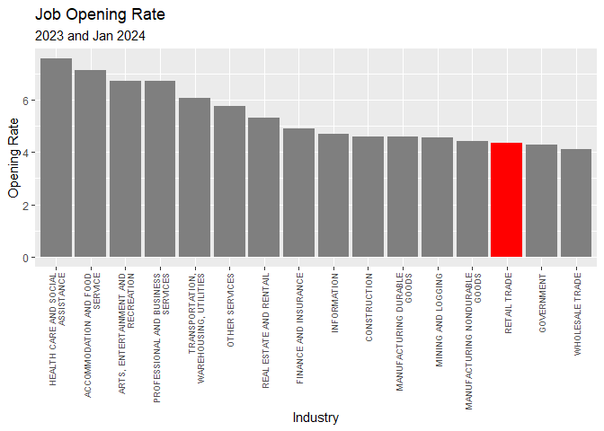
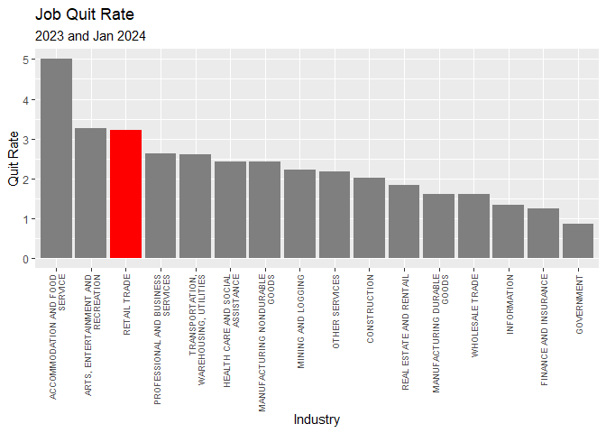

For this analysis, I read in a subset of U.S. Census Current Population
Survey data, which includes year, month, industry and employment status
information. The data was extracted from
[**IPUMS.org**](https://cps.ipums.org/cps/). My goal is to gain insight
on involuntary part-time work, particularly to tease out whether or not
involuntary part-time work stands out in the retail industry.

*Sarah Flood, Miriam King, Renae Rodgers, Steven Ruggles, J. Robert
Warren, Daniel Backman, Annie Chen, Grace Cooper, Stephanie Richards,
Megan Schouweiler, and Michael Westberry. IPUMS CPS: Version 11.0
\[dataset\]. Minneapolis, MN: IPUMS, 2023.
<https://doi.org/10.18128/*D030.V11.0>*

``` r
# Read in 2005-2024 census data
projpath<-"C:/Users/dancu/Documents/GitHub/Software-Tools-Spring-2024/Data_Tables"

ddi <- read_ipums_ddi(file.path(projpath,"cps_00001.xml"))
data <- read_ipums_micro(ddi)
```

    ## Use of data from IPUMS CPS is subject to conditions including that users should cite the data appropriately. Use command `ipums_conditions()` for more details.

``` r
head(data)
```

    ## # A tibble: 6 x 13
    ##    YEAR SERIAL MONTH       HWTFINL   CPSID ASECF~1 PERNUM WTFINL  CPSIDP  CPSIDV
    ##   <dbl>  <dbl> <int+lbl>     <dbl>   <dbl> <int+l>  <dbl>  <dbl>   <dbl>   <dbl>
    ## 1  2005      1 1 [January]   2872. 2.00e13 NA           1  2872. 2.00e13 2.00e14
    ## 2  2005      2 1 [January]   2552. 2.00e13 NA           1  2552. 2.00e13 2.00e14
    ## 3  2005      2 1 [January]   2552. 2.00e13 NA           2  3085. 2.00e13 2.00e14
    ## 4  2005      2 1 [January]   2552. 2.00e13 NA           3  2522. 2.00e13 2.00e14
    ## 5  2005      4 1 [January]   3287. 2.00e13 NA           1  3287. 2.00e13 2.00e14
    ## 6  2005      5 1 [January]   2156. 2.00e13 NA           1  3133. 2.00e13 2.00e14
    ## # ... with 3 more variables: IND1950 <int+lbl>, WHYPTLWK <int+lbl>,
    ## #   WKSTAT <int+lbl>, and abbreviated variable name 1: ASECFLAG

### Selected variables from [**IPUMS Census Data Definitions**](https://cps.ipums.org/cps-action/variables/group?id=core_work)

-   WHYPTLWK Reason for working part time last week
-   WKSTAT Full or part-time status
-   IND1950 Industry codes, which are [**comparable over
    time**](https://cps.ipums.org/cps-action/variables/IND1950#comparability_section)
-   WTFINL sample weight for survey respondent

The WHYPTLWK census variable provides detailed reasons for part-time
work. Here we have focused on **60 Could only find part-time work**.
This is a subgroup of a classification often referred to as “Part-Time
for Economic Reasons.”

``` r
ipums_val_labels(ddi, WHYPTLWK)%>% print(n=27)
```

    ## # A tibble: 27 x 2
    ##      val lbl                               
    ##    <dbl> <chr>                             
    ##  1     0 NIU                               
    ##  2     1 No response                       
    ##  3    10 Slack work, business conditions   
    ##  4    11 Material shortage                 
    ##  5    12 Plant or machine repairs          
    ##  6    20 Seasonal work                     
    ##  7    30 Weather affected job              
    ##  8    40 Labor dispute                     
    ##  9    50 job started/ended during week     
    ## 10    51 New job started                   
    ## 11    52 Job terminated                    
    ## 12    60 Could only find part-time         
    ## 13    70 Not want full time work           
    ## 14    71 Retired/SS limit on earnings      
    ## 15    80 Full time work week under 35 hours
    ## 16    81 Full time peak season only        
    ## 17    90 Holiday                           
    ## 18   100 Own illness                       
    ## 19   101 Health/medical limitation         
    ## 20   110 On vacation                       
    ## 21   111 Vacation/personal day             
    ## 22   120 Too busy with house, school, etc  
    ## 23   121 Child care problems               
    ## 24   122 Other family/personal obligations 
    ## 25   123 School/training                   
    ## 26   124 Civic/military duty               
    ## 27   130 Other

The WKSTAT variable provides data on work status. Here we have focused
on **12 Part-time for non-economic reasons, usually full-time** \| **20
Part-time for economic reasons** \| **21 Part-time for economic reasons,
usually full-time** \| **22 Part-time hours, usually part-time for
economic reasons** \| **40 Part-time for non-economic reasons, usually
part-time** \| **41 Part-time hours, usually part-time for non-economic
reasons**

``` r
ipums_val_labels(ddi, WKSTAT)
```

    ## # A tibble: 15 x 2
    ##      val lbl                                                        
    ##    <dbl> <chr>                                                      
    ##  1    10 Full-time schedules                                        
    ##  2    11 Full-time hours (35+), usually full-time                   
    ##  3    12 Part-time for non-economic reasons, usually full-time      
    ##  4    13 Not at work, usually full-time                             
    ##  5    14 Full-time hours, usually part-time for economic reasons    
    ##  6    15 Full-time hours, usually part-time for non-economic reasons
    ##  7    20 Part-time for economic reasons                             
    ##  8    21 Part-time for economic reasons, usually full-time          
    ##  9    22 Part-time hours, usually part-time for economic reasons    
    ## 10    40 Part-time for non-economic reasons, usually part-time      
    ## 11    41 Part-time hours, usually part-time for non-economic reasons
    ## 12    42 Not at work, usually part-time                             
    ## 13    50 Unemployed, seeking full-time work                         
    ## 14    60 Unemployed, seeking part-time work                         
    ## 15    99 NIU, blank, or not in labor force

#### Data Prep: Consolidate Industries and date data

Group industries based on [**IND1950
Codes**](https://cps.ipums.org/cps-action/variables/IND1950#codes_section).

``` r
data2 <- data %>%
  mutate(Industry = case_when(
    IND1950 >= 105 & IND1950 <= 126 ~ "Agriculture",
    IND1950 >= 206 & IND1950 <= 236 ~ "Mining",
    IND1950 == 246 ~ "Construction",
    IND1950 >= 306 & IND1950 <= 399 ~ "Manufacturing Durable Goods",
    IND1950 >= 406 & IND1950 <= 499 ~ "Manufacturing Nondurable Goods",
    IND1950 >= 506 & IND1950 <= 579 ~ "Transportation and Communication",
    IND1950 >= 586 & IND1950 <= 598 ~ "Utilities and Sanitary Services",
    IND1950 >= 606 & IND1950 <= 627 ~ "Wholesale Trade",
    IND1950 >= 636 & IND1950 <= 699 ~ "Retail Trade",
    IND1950 >= 716 & IND1950 <= 746 ~ "Finance, Insurance, and Real Estate",
    IND1950 >= 806 & IND1950 <= 817 ~ "Business and Repair Services",
    IND1950 == 826 ~ "Private Household Personal Services",
    IND1950 >= 836 & IND1950 <= 849 ~ "Personal services Other",
    IND1950 >= 856 & IND1950 <= 859 ~ "Entertainment and Recreation Services",
    IND1950 >= 868 & IND1950 <= 899 ~ "Professional and Related Services",
    IND1950 >= 906 & IND1950 <= 936 ~ "Public Administration",
    IND1950 >= 9997 & IND1950 <= 998 ~ "Other",
    TRUE ~ "Unknown"  # For values not covered in any range
  ))
```

Create a single Date field for time series

``` r
data3<-data2 %>%
  mutate(date = make_date(YEAR,MONTH))
# check
data3[,c(1,3,14,15)]%>% filter(YEAR==2012,MONTH==12)
```

    ## # A tibble: 132,664 x 4
    ##     YEAR MONTH         Industry                            date      
    ##    <dbl> <int+lbl>     <chr>                               <date>    
    ##  1  2012 12 [December] Unknown                             2012-12-01
    ##  2  2012 12 [December] Unknown                             2012-12-01
    ##  3  2012 12 [December] Professional and Related Services   2012-12-01
    ##  4  2012 12 [December] Retail Trade                        2012-12-01
    ##  5  2012 12 [December] Professional and Related Services   2012-12-01
    ##  6  2012 12 [December] Retail Trade                        2012-12-01
    ##  7  2012 12 [December] Professional and Related Services   2012-12-01
    ##  8  2012 12 [December] Unknown                             2012-12-01
    ##  9  2012 12 [December] Retail Trade                        2012-12-01
    ## 10  2012 12 [December] Private Household Personal Services 2012-12-01
    ## # ... with 132,654 more rows

#### Survey Sample Weighting

-   “For person-level analyses of non-supplement IPUMS-CPS data, apply
    the WTFINL variable. [**WTFINL gives the population represented by
    each individual in the
    sample.**](https://cps.ipums.org/cps-action/faq)”
-   A WTFINL value of 2469 means the survey respondent is representative
    of 2469 Americans.
-   The CPS survey is monthly. Therefore, each month should reflect a
    sample of the entire U.S. Population.

``` r
# Look at WTFINL Weight
feb24<-data3 %>% filter(YEAR==2024, MONTH==2)
sum(feb24$WTFINL)
```

    ## [1] 331331604

``` r
# 331,331,604 very close to U.S. Population
# For a given month, the weight values add up to the U.S. Population
```

To factor in the sample weights, we created 1-or-0 variables for “Could
only find part-time work” (OFPTW) and “Part-Time Work” (PTW). This
allows individuals who fit these categories to be easily multipled by
their WTFINL weighted value.

``` r
data4<-data3 %>% mutate(OFPTW = ifelse(WHYPTLWK==60,1,0),
                 PTW = ifelse(WKSTAT==12|WKSTAT==20|WKSTAT==21|WKSTAT==22|WKSTAT==40|WKSTAT==41,1,0))

data5<-data4[,c(1:3,8,11:17)] %>% filter(PTW==1)
data6<-data5 %>% mutate(W_OFPTW = WTFINL*OFPTW, W_PTW = WTFINL*PTW)
data6[,c(6:13)] %>% filter(Industry=="Retail Trade")
```

    ## # A tibble: 847,671 x 8
    ##    WHYPTLWK                WKSTAT   Indus~1 date       OFPTW   PTW W_OFPTW W_PTW
    ##    <int+lbl>               <int+lb> <chr>   <date>     <dbl> <dbl>   <dbl> <dbl>
    ##  1 111 [Vacation/personal~ 12 [Par~ Retail~ 2005-01-01     0     1      0  2455.
    ##  2  60 [Could only find p~ 22 [Par~ Retail~ 2005-01-01     1     1   2469. 2469.
    ##  3  60 [Could only find p~ 22 [Par~ Retail~ 2005-01-01     1     1   2898. 2898.
    ##  4 123 [School/training]   41 [Par~ Retail~ 2005-01-01     0     1      0  2591.
    ##  5  71 [Retired/SS limit ~ 41 [Par~ Retail~ 2005-01-01     0     1      0  1819.
    ##  6 123 [School/training]   41 [Par~ Retail~ 2005-01-01     0     1      0  2767.
    ##  7 123 [School/training]   41 [Par~ Retail~ 2005-01-01     0     1      0  2012.
    ##  8 111 [Vacation/personal~ 12 [Par~ Retail~ 2005-01-01     0     1      0  2253.
    ##  9  80 [Full time work we~ 41 [Par~ Retail~ 2005-01-01     0     1      0  2663.
    ## 10 123 [School/training]   41 [Par~ Retail~ 2005-01-01     0     1      0  2983.
    ## # ... with 847,661 more rows, and abbreviated variable name 1: Industry

``` r
# Now the W_PTW column factors in the survey respondent's sample weight WTFINL
# WTFINL gives the population represented by each individual in the sample. 
# A WTFINL weight of 2469 means the survey respondent can be scaled up to represent 2469 Americans.
# W_OFPTW is 0 unless the person could only find part-time work
```

#### How many people are we talking about?

``` r
# December 2023
data6 %>% filter(YEAR==2023,MONTH==12) %>% summarize(involPT=round(sum(W_OFPTW),0), partTotal=round(sum(W_PTW),0))
```

    ## # A tibble: 1 x 2
    ##   involPT partTotal
    ##     <dbl>     <dbl>
    ## 1 1063383  35617108

Retail tops the list of total workers who could only find part-time work
in December 2023. (Although in terms of sheer population, this *is* a
pretty small % of the workforce.)

``` r
data6 %>% filter(YEAR==2023,MONTH==12)%>% group_by(Industry) %>% summarize(involPT=round(sum(W_OFPTW),0), partTotal=round(sum(W_PTW),0)) %>% arrange(desc(involPT)) %>% print(n=16)
```

    ## # A tibble: 16 x 3
    ##    Industry                              involPT partTotal
    ##    <chr>                                   <dbl>     <dbl>
    ##  1 Retail Trade                           415690   9775003
    ##  2 Professional and Related Services      260020  10475683
    ##  3 Business and Repair Services           120296   3136741
    ##  4 Entertainment and Recreation Services   41295   1418230
    ##  5 Construction                            37057   1914461
    ##  6 Private Household Personal Services     35302    456285
    ##  7 Agriculture                             34421   1105318
    ##  8 Personal services Other                 33804   1361142
    ##  9 Public Administration                   23371   1190582
    ## 10 Transportation and Communication        21909   1127274
    ## 11 Finance, Insurance, and Real Estate     17581   1475906
    ## 12 Manufacturing Durable Goods              9327    851543
    ## 13 Manufacturing Nondurable Goods           8960    735425
    ## 14 Utilities and Sanitary Services          4349    152567
    ## 15 Mining                                      0     55751
    ## 16 Wholesale Trade                             0    385198

#### Look at Time Series by Industry 2005-2024

The % of part-time workers who *can only find* part-time work fluctuates
with a similar trend across most industries. The Retail Industry appears
to sustain a higher level of workers who can only find part-time work.
The dashed reference line at 5% helps emphasize this.

``` r
data_summary6<-data6 %>% group_by(date,Industry) %>%
  summarize(involPT=sum(W_OFPTW), partTotal=sum(W_PTW)) %>%
  mutate(involPctofPT = round((involPT/partTotal)*100,2))
```

    ## `summarise()` has grouped output by 'date'. You can override using the `.groups`
    ## argument.

``` r
# Time Series
ggplot(data_summary6, aes(x=date, y=involPctofPT))+geom_line()+facet_wrap(~ str_wrap(Industry, width = 20)) +
  labs(title = "Could only Find Part-Time Work", subtitle="% of Part-Time Workers by Industry: 2005-2024",x="2005-2024 Time Period", y="% of Part-Time Workers")+
  theme(axis.text.x = element_blank()) +
  theme(axis.ticks.x = element_blank()) +
  geom_hline(yintercept = 5, linetype = "dashed", color = "red")
```



#### Zoom in on Retail

``` r
data_summary6 %>% filter(Industry=="Retail Trade") %>%
ggplot(data=., aes(x=date, y=involPctofPT))+geom_line()+
  labs(title = "Could only Find Part-Time Work", subtitle="% of Part-Time Workers by Industry (Retail): 2005-2024",x="Year", y="% of Part-Time Workers")+
geom_hline(yintercept = 5, linetype = "dashed", color = "red")
```



#### Look at mean values during full time period

Retail ranks high. This, along with the previous time series, shows
retail workers who can only find part-time work are **not** a new
phenomenon.

``` r
# Bar Plots
data_summary6 %>% filter(Industry!="NA")%>% group_by(Industry) %>% 
  summarize(meanInvolPctofPT=mean(involPctofPT))%>%
  ggplot(data =., aes(x=reorder(Industry, -meanInvolPctofPT), y=meanInvolPctofPT, fill=Industry)) + 
  geom_col() + 
  theme(axis.text.x = element_text(angle = 90, vjust = 0.5, hjust = 1, size = 7)) +
  scale_x_discrete(labels = function(x) str_wrap(x, width = 25)) +
  scale_fill_manual(values = c("Retail Trade" = "red")) +
  ggtitle("Could only find part-time work", subtitle="% of Total Part-Time Workers by Industry: 2005 - Feb 2024")+
  labs(x = "Industry", y = "% of Part-Time Workers")+
  guides(fill = "none")
```



#### Look at 2023-2024 - still worth double-checking the most recent data.

Retail still ranks high.

``` r
# Create data set of recent years 2023-2024
data_summary7<-data6 %>% filter(YEAR>2023) %>% group_by(date,Industry) %>%
  summarize(involPT=sum(W_OFPTW), partTotal=sum(W_PTW)) %>%
  mutate(involPctofPT = round((involPT/partTotal)*100,2))
```

    ## `summarise()` has grouped output by 'date'. You can override using the `.groups`
    ## argument.

``` r
data_summary7 %>% filter(Industry!="NA")%>% group_by(Industry) %>% 
  summarize(meanInvolPctofPT=mean(involPctofPT))%>%
  ggplot(data =., aes(x=reorder(Industry, -meanInvolPctofPT), y=meanInvolPctofPT, fill=Industry)) + 
  geom_col() + 
  theme(axis.text.x = element_text(angle = 90, vjust = 0.5, hjust = 1, size = 7)) +
  scale_x_discrete(labels = function(x) str_wrap(x, width = 25)) +
  scale_fill_manual(values = c("Retail Trade" = "red")) +
  ggtitle("Could only find part-time work", subtitle="% of Total Part-Time Workers by Industry: 2023 - Feb 2024")+
  labs(x = "Industry", y = "% of Part-Time Workers")+
  guides(fill = "none")
```



#### Compare barplot of 2023-2024 data to recent jobs opening and quit rates

Read in Job Opening Rates and Quit Rates Monthly Average by Industry
(2023 and Jan 2024 preliminary results) Industry classifications from
this dataset are slightly different.

``` r
jolts<-read.csv(file.path(projpath,"JOLTS.csv"))
head(jolts)
```

    ##                           ï..    Series.ID Jan.2023 Feb.2023 Mar.2023 Apr.2023
    ## 1          MINING AND LOGGING Opening_Rate      5.0      5.2      5.0      5.2
    ## 2          MINING AND LOGGING    Quit_Rate      2.6      2.6      2.4      1.7
    ## 3                CONSTRUCTION Opening_Rate      3.6      4.9      3.5      4.4
    ## 4                CONSTRUCTION    Quit_Rate      2.3      1.9      1.8      1.9
    ## 5 MANUFACTURING DURABLE GOODS Opening_Rate      5.5      5.1      5.1      4.6
    ## 6 MANUFACTURING DURABLE GOODS    Quit_Rate      1.8      2.1      1.8      1.5
    ##   May.2023 Jun.2023 Jul.2023 Aug.2023 Sep.2023 Oct.2023 Nov.2023 Dec.2023
    ## 1      4.5      4.3      4.4      4.1      4.3      3.6      4.6      4.7
    ## 2      2.5      2.5      2.4      2.5      1.8      2.1      2.3      1.8
    ## 3      4.5      4.9      4.2      4.6      5.0      4.9      5.3      5.1
    ## 4      2.7      2.2      2.1      2.0      1.7      2.1      2.0      1.8
    ## 5      4.3      4.4      4.3      4.5      4.2      4.3      4.4      4.8
    ## 6      1.7      1.4      1.6      1.3      1.5      1.6      1.6      1.5
    ##   Jan.2024
    ## 1      4.4
    ## 2      1.6
    ## 3      4.8
    ## 4      1.8
    ## 5      4.2
    ## 6      1.6

``` r
colnames(jolts)
```

    ##  [1] "ï.."       "Series.ID" "Jan.2023"  "Feb.2023"  "Mar.2023"  "Apr.2023" 
    ##  [7] "May.2023"  "Jun.2023"  "Jul.2023"  "Aug.2023"  "Sep.2023"  "Oct.2023" 
    ## [13] "Nov.2023"  "Dec.2023"  "Jan.2024"

``` r
names(jolts)[names(jolts) == "ï.."] <- "industry"
jolts<-data.table(jolts)

# melt month columns into rows
jolts2<- data.table::melt(data = jolts,
                          id.vars = c("industry", "Series.ID"),
                          measure.vars = c("Jan.2023",  "Feb.2023",  "Mar.2023",  "Apr.2023",  "May.2023",  "Jun.2023",  "Jul.2023", "Aug.2023",
                                           "Sep.2023",  "Oct.2023",  "Nov.2023",  "Dec.2023",  "Jan.2024"))

head(jolts2)
```

    ##                       industry    Series.ID variable value
    ## 1:          MINING AND LOGGING Opening_Rate Jan.2023   5.0
    ## 2:          MINING AND LOGGING    Quit_Rate Jan.2023   2.6
    ## 3:                CONSTRUCTION Opening_Rate Jan.2023   3.6
    ## 4:                CONSTRUCTION    Quit_Rate Jan.2023   2.3
    ## 5: MANUFACTURING DURABLE GOODS Opening_Rate Jan.2023   5.5
    ## 6: MANUFACTURING DURABLE GOODS    Quit_Rate Jan.2023   1.8

Retail has a relatively low Job Opening Rate

``` r
jolts2 %>% filter(Series.ID=="Opening_Rate")%>% group_by(industry)%>% summarize(meanOpenings=mean(value))%>%
  ggplot(data =., aes(x=reorder(industry, -meanOpenings), y=meanOpenings, fill=industry)) + 
  geom_col() + theme(axis.text.x = element_text(angle = 90, vjust = 0.5, hjust = 1, size = 7))+
  scale_fill_manual(values = c("RETAIL TRADE" = "red")) +
  scale_x_discrete(labels = function(x) str_wrap(x, width = 25)) +
  ggtitle("Job Opening Rate", subtitle = "2023 and Jan 2024")+
  labs(x = "Industry", y = "Opening Rate")+
  guides(fill = "none")
```



Retail has a relatively high Quit Rate

``` r
jolts2 %>% filter(Series.ID=="Quit_Rate")%>% group_by(industry)%>% summarize(meanQuits=mean(value))%>%
  ggplot(data =., aes(x=reorder(industry, -meanQuits), y=meanQuits, fill=industry)) + 
  geom_col() + theme(axis.text.x = element_text(angle = 90, vjust = 0.5, hjust = 1, size = 7))+
  scale_fill_manual(values = c("RETAIL TRADE" = "red")) +
  scale_x_discrete(labels = function(x) str_wrap(x, width = 25))+
  ggtitle("Job Quit Rate", subtitle = "2023 and Jan 2024")+
  labs(x = "Industry", y = "Quit Rate")+
  guides(fill = "none")
```



##### Over the past year, Retail has maintained a high pecentage of workers who are forced to work part-time because they could only find part-time work. Retail also has relatively low Job Openings and a higher Quit Rate. We can continue to analyze these dynamics.
