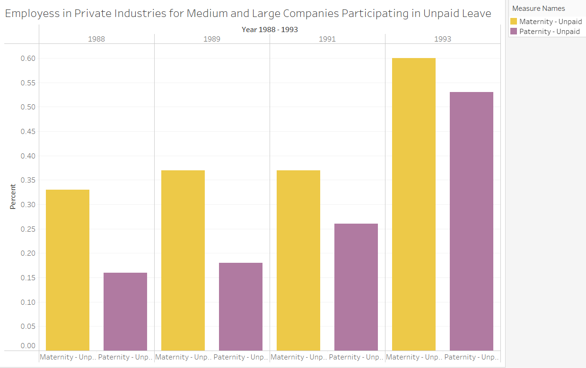
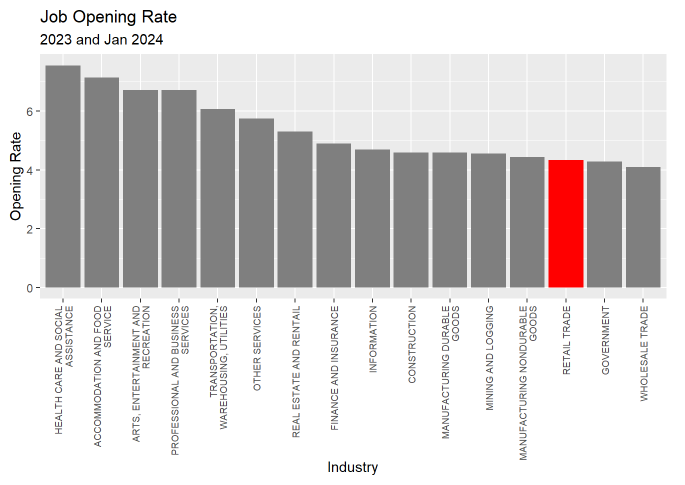

cgch 4/17 updating to include all the work we collaborated on in Google Doc!
##### slide 1
# GROUP Project 4/24/2024
## Introduction

Welcome to Group 1’s Course Project for ADEC 7900 Software Tools for Data Analysis.

Over several weeks we considered various research project ideas, each playing 
to our strengths, reading, finding potential data sources, and corresponding with
potential resources.

By consensus we determined that the best research project topic with the
greatest potential for available data would be to address a policy maker
working on underemployment and its impact on the economic welfare of
their constituents.

##### slide 2
Our lead question came from "It’s Not Just Wages. Retailers Are
Mistreating Workers in a More Insidious Way." Feb. 19, 2024 By Adelle
Waldman.
<https://www.nytimes.com/2024/02/19/opinion/part-time-workers-usa.html>
Ms. Waldman’s forthcoming novel, “Help Wanted,” takes place in a big-box
store.

In her New York Times column, Waldman writes, "Many people choose to work part time for better work-life balance or to attend school or to care for children or other family members. But many don’t. In recent years, part-time work has become the default at many large chain employers, an involuntary status imposed on large numbers of their lowest-level employees."

##### slide 3
If an industry has a higher proportion of part-time vs. full-time laborers, then they will probably demonstrate a higher proportion of involuntary part-time workers, which doesn't provide a meaningful insight. To confirm whether retail has a higher rate of part-time workers, we examined the percentage of involuntary part-time workers as a percentage of total part-time workers rather than as a percentage of total workers in an industry. Our approach gave us a measure of involuntary part-time work relative to total part-time workers. This compared the "could only find" crowd to the entire "seasonal, vacation, school, sniffles, family care, don't feel like it" crowd across all industries.

##### slide 4
To examine this assertion, we referenced employment data from the U.S. Census Current Population Survey. 

##### slide 5
Using this framework, we found that the Retail Industry was a national leader in this classification of involuntary part-time work. This finding provides a strong foundation for Waldman's claim. 

###### slide 6
Data compiled by United For ALICE (a grassroots movement that conducts research to determine meaningful data regarding households that meet criteria for designation as Asset Limited, Income Constrained, Employed ( or ALICE).

This data shows the U.S. Retail Industry has a high percentage of workers who do not attain a threshold of Economic Viability, this phenomenon of involuntary part-time likely contributes to this problem, and is a potential blind spot in current public policy. 

The retail Industry leads the ALICE rankings with the highest number of workers below the ALICE threshold with 5,645,233 of whom 53% are full-time and 47% are part-time. 

With our estimation of 415,690 involuntary part-time U.S. retail workers in December 2023, this means up to 415,690/5,645,233 = 7.36% of this population could be explained by the "Waldman Effect." Definitely a starting point for public policy scrutiny aimed at shaving a few percentage points off this figure of economic inviability.

##### slide 7
These graphs clearly show that the Retail Industry dominates the category “Could only find part-time employment” as a “Percent of Part-time workers” for the 20 year period 2005 - 2024 and is second only to “Mining” for the most recent period from 2023 to 20024.

##### slide 8
### Is this really an insidious problem?
### How long has this been going on?

We looked at the last 20 years, creating a Time Series by Industry for 2005-2024 finding that the percentage of part-time workers who can only find part-time work fluctuates similarly across most industries. The Retail Industry appears to sustain a higher level of workers who can only find part-time work.

##### slide 9
## HOW DID WE GET HERE? 
The St Louis Economic Research data goes back 30 years,but

##### slide 10 
… since the data we were able to use for our analysis only went back to 2005, this is a better reference for our purposes. U6 rate 2005-2024

##### slide 11
## A VERY BRIEF HISTORY of US Labor Policy 

The US has a long history of entrepreneurship and an equally long history of legislation favoring business and property owners over labor.
From the earliest indentured servants and slaves, through 19th century post civil war enforced labor during incarceration, 20th century deadly suppression of labor unions, and the current state of lobbying by businesses and their representatives.

##### slide 12
Effective January 10, 2024, the U.S. Department of Labor modified Wage and Hour Division regulations to replace its analysis for determining employee or independent contractor classification under the Fair Labor Standards Act with an analysis that is more consistent with judicial precedent and the Act's text and purpose.

##### slide 13
“Over the 20th century, federal law created minimum social and economic rights, and encouraged state laws to go beyond the minimum to favor employees.
The Fair Labor Standards Act of 1938 requires a federal minimum wage, currently $7.25 but higher in 29 states and D.C., and discourages working weeks over 40 hours through time-and-a-half overtime pay. 
There are no federal laws, and few state laws, requiring paid holidays or paid family leave. 
The Family and Medical Leave Act of 1993 creates a limited right to 12 weeks of unpaid leave from larger employers. 
There is no automatic right to an occupational pension beyond federally guaranteed Social Security,
but the Employee Retirement Income Security Act of 1974 requires standards of prudent management and good governance if employers agree to provide pensions, health plans or other benefits. 
The Occupational Safety and Health Act of 1970 requires employees have a safe system of work.”

##### slide 14

The act establishing the Department of Labor was signed on March 4, 1913, by a reluctant President William Howard Taft, the defeated and departing incumbent, just hours before Woodrow Wilson took office. 

A Federal Department of Labor was the direct product of a half-century campaign by organized labor for a "Voice in the Cabinet," and an indirect product of the Progressive Movement. 

In the words of the original act, the DOL's purpose is "to foster, promote and develop the welfare of working people, to improve their working conditions, and to enhance their opportunities for profitable employment."

##### slide 15

The most recent piece of legislation from the Department of Labor under the Fair Labor Standards Act replaces the analysis for determining employee or independent contractor classification under the Fair Labor Standards Act (FLSA or Act) with an analysis that is more consistent with judicial precedent and the Act's text and purpose.
Should we apply this same analysis to part-time employees?
Part-time employees currently have limited access to:

### FMLA
The Family and Medical Leave Act (FMLA) covers only larger employers with at least 50 employees. 
And, it covers only employees who meet these three requirements:

! You must have worked for your employer for at least a year.
! You must work at a location that has at least 50 of your company's employees within a 75-mile radius.
! You must have worked at least 1,250 hours during the 12 months immediately before you take leave.

The act provides employees who meet these requirements with up to 12 weeks of unpaid, job-protected leave per year. FMLA was passed in 1993. Per our analysis, the percentage of employees with access to unpaid family leave was 84% in 1995 and has only increased five percentage points since then. 
Access to paid family leave, however, has grown from 2% in 1995 to 27% in 2023. 

##### slide 16
Similar data was not found for years prior to 1993, however, the Bureau of Labor Statistics did provide the percent of private industry workers in medium and large establishment participating in unpaid leave benefits. 
This data showed that percent of workers using unpaid maternity leave increased from 33% in 1988 to 60% in 1993 and an even larger increase was seen for workers using unpaid paternity leave as the percentage increased from 16% to 53% in the same years..
The impact could be socially driven, but it does appear that in the years following the FLMA act, most employees have had access to unpaid family leave

##### slide 17
## PTO

In the absence of an applicable state or local law, it's up to the employer to decide whether their part-time employees receive paid time off or vacation time, and if so, how much.
This table reports rates of PTO for all employees from 1998 to 2023. Access to paid vacation in Blue. Access to paid sick leave in Red, and Access to Paid holidays in Orange.
IF there is no federal law requiring paid time off, yet most employers are providing it, but PTO benefits are usually an advantage of Full-time employees, is this a case of business moving to do the right thing because of market pressure instead of legislation is driving change?

##### slide 18
## Real Wage Value and Purchasing Power
We also compared wages in retail to their real wage value and purchasing power
According to the Bureau of Labor Statics May 2023, category 41-2031 Retail Salespersons sell merchandise, such as furniture, motor vehicles, appliances, or apparel to consumers average wage $36,690. Excludes “Cashiers” (41-2011). Whereas according to the Census Bureau, Cashiers were among the lowest-paid members of the retail workforce. In 2023, their median earnings ($30,710) were around 47% less than those of all full-time, year-round workers ($57,216).

We did our own analysis of average real wages using Federal Reserve Economic Data and a manual calculation to adjust for inflation. Real Wage in a year = (Nominal Wage in a Year/CPI in a Year)x100

Per our results, real wages for retailers appear to have decreased from around 2006 to 2011 and then began increasing until the COVID-19 Pandemic beginning in 2020.

##### slide 19
The Fair Labor and Standards Act provides additional requirements for companies to further establish employee protections. The act specifically establishes minimum wage, overtime pay, recordkeeping, and youth employment standards. 

Per data from FRED the average hourly earnings of all employees in retail trade had only minor increases between 2007 and 2009 when the minimum wage was increased three times. Starting in 2010, the average wage for employees in retail has increase more dramatically. Since the last increase in the federal minimum wage was on July 24, 2009, this analysis indicates that minimum wage laws may have less of an effect on the hourly wage for retail employees than other sources. 

For our purposes in deciding whether or not to establish a policy requiring a minimum percentage of full-time employees, analysis of minimum wages suggests policy would not be the driving force behind significant change in employer hiring practices.

##### slide 20
## Health Care
Similarly, when determining if trends in PT are voluntary or forced, we can look at other quality of life indicators. 

Here we can compare health care insurance coverage by type. Notice that “non-group” reports insurance purchased independently rather than through an employer's group coverage. It includes the Affordable Health Care marketplace for ACA health insurance coverage.

The Patient Protection and Affordable Care Act (ACA) became law on March 23, 2010 and since then, the quantity of uninsured individuals has decreased, while the quantity of those insured by Medicaid and Medicare have mostly trended upward (the trend in medicare however may be due more to an aging population rather than any change in policy). Additionally, since 2010, the percentage of people insured through their employer has decreased while the percentage receiving insurance independently (or the “non-group population) remained relatively consistent.

Since the goal of the ACA was to allow access to healthcare for all Americans, a reduction in the number of uninsured individuals as well as a continued trend in this direction since 2010 signifies a possible potential impact. 

Due to a lack of available data, our analysis does not however account for any possible correlations in data and has no statistical significance calculation.

##### slide 21
## Employer Practices - recent history

1. Every CEO in office will have read one of the Harvard Business Review’s succession planning Case Studies and understands the UMass Global article "Three Ways businesses that [promoting] from within can benefit [employers]"
   
! Promoting from within can save time and money
! Internal mobility can help with retention and motivation
! There’s less risk involved with internal promotions. Creating a pipeline for full time store personnel to join the executive training program should be cost effective. It could also generate a good public relations opportunity.

##### slide 22
2. Some of the biggest retailers have offered tuition reimbursement and better work schedules including consistency and full-time schedules, and then withdrawn those benefits.

##### slide 23
3. According to the BLS many retail jobs do not pay a living wage. 
Our analysis of data from IPUMS.org has found that retail consistently sustains a higher level of part-time workers when compared with other sectors.
IPUMS is a part of the Institute for Social Research and Data Innovation at the University of Minnesota and is directed by Regents Professor Steven Ruggles.

##### slide 24
## Economic welfare of constituents

Our stated objective is to address a policy maker working on underemployment and its impact on the economic welfare of their constituents. Our analysis estimated 415,690 involuntary part-time U.S. retail workers in December 2023. The "Waldman Effect" could explain up to 7.36% of involuntary retail workers’ jobs. Definitely a starting point for public policy scrutiny aimed at shaving a few percentage points off this figure of economic inviability.

###### slide 25
Although the initial furor over the potential impact on employers of the ACA has not created the feared changes to numbers of employees, nor to the number of hours employees worked, advancing technology is making it easier for employers to identify scheduling needs resulting in last minute changes to employee schedules. 

Technology is not going away and AI will continue to impact work, so finding a way to reduce or eliminate irregular schedules is central to addressing what has become the default at many large chain employers; involuntary part-time employment.

##### slide 26
Over the past year, Retail has maintained a high percentage of workers who are forced to work part-time because they could only find part-time work. 

Retail also has a higher Job Quit Rate and lower Job Openings Rate.

##### slide 27
McKinsey Frontline Retail Great Attrition and Great Attraction Survey, April 2022, offers a dozen reasons why retail employees are quitting and suggests four imperatives, foremost being:
! Understand the frontline talent pools and build distinctive employee value proposition(s). 
! The frontline retail workforce is large and includes a diverse set of workers with a wide range of needs. 
! Retailers need to identify the talent pool that best fits their company
! Determine what matters to those segments of workers, and 
! Develop an employee value proposition tailored to the unique needs of their employee segment(s).

##### slide 28
## Our key takeaways

! The US Census Bureau reports that “the relative number of U.S. retail workers remained over 9 million, but their share of the total workforce fell from 6.9% in 2010 to 5.6% in 2022.” 

! In 2023-2024 data Retail represents 5% of all part-time labor which is down from 8% for 2005-2024 
! Part-time labor in retail peaked between 2008 and 2015 when it remained above 10% and visited 13% repeatedly. 
! Part-time labor dropped below 5% in 2020, presumably when COVID shut down many in person shopping venues.
! Part-time retail labor has hovered around 5% of total labor since 2020.
! December 2023, up to 7.36% of retail labor is involuntarily part-time representing the “Waldman Effect”

###### slide 29
Northeastern Professor Dennis R. Shaughnessy corrects the oft misquoted  “The business of America is business!”   Actually, President Coolidge said that the “chief business of the American people is business.”  

It appears then that the original idea behind Coolidge’s idea was indeed to praise business leaders and the business community for driving the economic prosperity of America and its people. But it also appears that he did not believe that business alone, or self-interest and wealth accumulation, are what drives Americans and our society forward. Rather, it is the higher ideals such as peace, honor and charity that make up the core of American values. 

… As Professor Shaughnessy reflects back on the words of President Coolidge, President Reagan and President Trump, we agree with his hopes that the idea of being “pro-business” is not interpreted narrowly to require a diminishment of social commitments. 

###### slide 30
We have determined that this retail industry practice of hiring part-time workers and then choosing to hire more part-time workers rather than increasing the work hours of existing staff is not new. 

This practice is insidious because it subjects workers to dynamic schedules which confounds a worker’s ability to manage caring for family or scheduling a second job.

Think tanks and State legislatures offer ideas that could be expanded to the federal level. 
Case in point is the  report “Still falling short on hours and pay. Part-time work becoming [the] new normal” from the Economic Policy Institute by Lonnie Gold published on December 5, 2016.

###### slide 31
Our recommendation is to adopt the San Jose, CA 2017 policy because it has a proven track record and would be consistent with a future update to federal tax code reversing rules regarding exclusion of part-timers from many types of benefits, which currently make it attractive for employers to hire more part-time than full-time employees if benefits are increasing in cost more than wage compensation. 

https://www.epi.org/publication/still-falling-short-on-hours-and-pay-part-time-work-becoming-new-normal/
(see Lambert, Fugiel, and Henly 2014; Alexander and Haley-Lock 2015).

###### slide 32 
Schoolhouse Rock: How a Bill Becomes a Law, https://www.youtube.com/watch?v=men-vp5jvzI

Finally, if these incremental changes are insufficient to alleviate the burden of involuntary part-time hours, then it might be time for Congress to act with legislation requiring all workers receive all benefits prorated to reflect the differences in hours worked. “This would reduce the number of Americans working in involuntary part-time positions, as employers would no longer stand to gain as much from employing part-time workers (Tilly 1990).”

# END SLIDE DECK CONVERSION TO README REPORT

# I've left the pre-slide deck readme file here below since most of the graphs and visualizations are her.

# PLEASE move the graphs, visualizations and images to their new locations based on the slide deck.

To examine this assertion, we referenced employment data from the U.S. Census Current Population Survey. We specifically focused our analysis on workers who reported they "could only find part-time work," as this response to CPS Question "WHYPTLWK Reason for working part time last week" most closely aligned with the concept of involuntary part-time work. We isolated this group who "could only find part-time work" from other respondents who cited many other reasons for part-time work: seasonality, schooling, health or family care, simply not wanting to work full time, etc. 

Given that retail likely has a higher rate of part-time workers, we examined the percentage of involuntary part-time workers  as a percentage of total part-time workers, not as a percentage of total workers in an industry. If an industry has a higher proportion of part-time vs. full-time laborers, then they will probably demonstrate a higher proportion of most part-time subcategories, which doesn't provide a meaningful insight. Our approach gave us a measure of involuntary part-time work relative to total part-time workers. This compared the "could only find" crowd to the entire "seasonal, vacation, school, sniffles, family care, don't feel like it" crowd across all industries.

As data compiled by the ALICE organization shows the U.S. Retail Industry has a high percentage of workers who do not attain a threshold of Economic Viability, this phenomenon of involuntary part-time likely contributes to this problem, and is a potential blind spot in current public policy. The retail Industry leads the ALICE rankings with the highest number of workers below the ALICE threshold with 5,645,233. With our estimation of 415,690 involuntary part-time U.S. retail workers in December 2023, this means up to 415,690/5,645,233 = 7.36% of this population could be explained by the "Waldman Effect." Definitely a starting point for public policy scrutiny aimed at shaving a few percentage points off this figure of economic inviability. 

 

These graphs clearly show that the Retail Industry dominates the
category “Could only find part-time employment” as a “Percent of
Part-time workers” for the 20 year period 2005 - 2024 and is second only to
“Mining” for the most recent period
from 2023 to 2024.

Drew Abrahamson created this ALICE Economic Viability Dashboard
<https://www.unitedforalice.org/alice-evd> on Tableau Public
<https://public.tableau.com/app/profile/drew7327/viz/EVD_working/EVD-Page1>

“The ALICE Economic Viability Dashboard reveals the economic and
community conditions of people who are struggling financially — those
below the ALICE Threshold. This includes people in households with
income below the Federal Poverty Level (FPL) and those who are ALICE
(Asset Limited, Income Constrained, Employed), with income above the FPL
but below the cost of basics.” EVD_working by Drew Abrahamson on
Tableau.com

The retail Industry leads with the highest number of workers below the
ALICE threshold with 5,645,233 of whom 53% are full-time and 47% are
part-time.

### insert first graph from ALICE EVD

From <https://www.unitedforalice.org/alice-evd>

## Real Wage Value and Purchasing Power

Comparing wages in retail to their real wage value and purchasing power

According to the BLS <https://www.bls.gov/oes/current/oes412031.htm>,
May 2023, category 41-2031 Retail Salespersons sell merchandise, such as
furniture, motor vehicles, appliances, or apparel to consumers average
wage \$36,690. Excludes “Cashiers” (41-2011).

Whereas according to the Census Bureau,
<https://www.census.gov/library/stories/2023/12/holiday-retail-workers.html#>:\~:text=In%202022%2C%20their%20median%20earnings,2010%20to%205.6%25%20in%202022
Cashiers were among the lowest-paid members of the retail workforce. In
2023, their median earnings (\$30,710) were around 47% less than those
of all full-time, year-round workers (\$57,216).

We did our own analysis of average real wages using data from FRED and a
manual calculation to adjust for inflation 

Real Wage in a year = (Nominal Wage in a Year/CPI in a Year)x100

Per our results, real wages for retailers appear to have decreased from around 2006 to 2011 and then began increasing until the COVID-19 Pandemic beginning in 2020.  

### insert a sentence or two more after adjusting the graph to include the ranges for the real wages and the nominal wages
Calculating the real wage and purchasing power for each wage data point
provided by FRED

Additionally, The Fair Labor and Standards Act provides additional requirements for companies to further establish employee protections. The act specifically establishes minimum wage, overtime pay, recordkeeping, and youth employment standards. Per data from FRED the average hourly earnings of all employees in retail trade had only minor increases between 2007 and 2009 when the minimum wage was increased three times. Starting in 2010, the average wage for employees in retail has increase more dramatically. Since the last increase in the federal minimum wage was on July 24, 2009, this analysis indicates that minimum wage laws may have less of an effect on the hourly wage for retail employees than other sources. For our purposes in deciding whether or not to establish a policy requiring a minimum percentage of full-time employees, analysis of minimum wages suggests policy would not be the driving force behind significant change in employer hiring practices.  

Similarly, when determining if trends in PT are voluntary or forced, we can look at other quality of life indicators

## Health Care Insurance

Here we can compare health care insurance coverage by type. Notice that
“non-group” reports insurance purchased independently rather than
through an employer's group coverage. It includes the Affordable Health
Care marketplace for insurance ACA coverage.

The Patient Protection and Affordable Care Act1 (ACA) became law on March 23, 2010 and since then, the amount of unisured individuals has decreased, while the amount of those insured by Medicaid and Medicare have mostly trended upward. Since the goal of the ACA was to allow access to healthcare for all Americans, a reduction in the number of unisured individuals as well as a continued trend in this direction since 2010 signifies a possible potential impact. Due to a lack of available data, our analysis does not however account for any possible correlations in data and has no statistical significance calculation. 

# Is this really an insidious problem? How long has this been going on?

We looked at the last 20 years, creating a Time Series by Industry for
2005-2024 finding that the % of part-time workers who can only find
part-time work fluctuates similarly across most industries (data
provided by IPUMS.org; see Appendix 1 with a link to our RPubs
publication).

The Retail Industry appears to sustain a higher level of workers who can
only find part-time work, which is the origin of our first graph.

# HOW DID WE GET HERE?

The St Louis Economic Research data goes back 30 years,

Big Picture (U6 rate <https://fred.stlouisfed.org/series/U6RATE>) for 30
years

## Insert FRED graph for 30 years

But since the data we were able to use for our analysis only went back
to 2005, this is a better reference for our purposes. U6 rate 2005-2024
<https://fred.stlouisfed.org/series/U6RATE>

## Insert FRED graph for 20 years

# Policy Actions - history

The US has a long history of entrepreneurship and an equally long
history of legislation favoring business and property owners over labor.

From the earliest indentured servants and slaves, through 19th century
post civil war enforced labor during incarceration, 20th century deadly
suppression of labor unions, and the current state of lobbying by
businesses and their representatives.

The most recent piece of legislation from the Department of Labor under the Fair Labor Standards Act replaces the analysis for determining employee or independent contractor classification under the Fair Labor Standards Act (FLSA or Act) with an analysis that is more consistent with judicial precedent and the Act's text and purpose.

Should we apply this same analysis which is more consistent with judicial precedent and the Fair Labor Standards Act's text and purpose to part-time employees?

Part-time employees currently have limited access to:

## FMLA 
The Family and Medical Leave Act (FMLA) covers only larger employers, those with at least 50 employees. And, it covers only employees who meet these three requirements:

 + You must have worked for your employer for at least a year.
 + You must work at a location that has at least 50 of your company's employees within a 75-mile radius.
 + You must have worked at least 1,250 hours during the 12 months immediately before you take leave.

The act provides employees who meet these requirements with up to 12 weeks of unpaid, job-protected leave per year. FMLA was passed in 1993. Per our analysis, the  percentage of employees with access to unpaid family leave was 84% in 1995 and has only increased five percentage points since then. Access to paid family leave, however, has grown from 2% in 1995 to 27% in 2023. Similar data was not found for years prior to 1993, however, the Bureau of Labor Statistics did provide the percent of private industry workers in medium and large establishment participating in unpaid leave benefits. This data showed that percent of workers using unpaid maternity leave increased from 33% in 1988 to 60% in 1993 and an even larger increase was seen for workers using unpaid paternity leave as the percentage increased from 16% to 53% in the same years. The impact could be socially driven, but it does appear that in the years following the FLMA act, most employees have had access to unpaid family leave.

 
 

# AND If your part-time schedule includes more than 24 hours per week, you will be covered by the law. 
But, if you haven't worked enough hours yet, don't give up. Your employer is required to tally up your hours as of the day your leave starts, not the day you request leave or give notice that you will need it. It sounds like you also have some leeway as to when to schedule your surgery. This means you can try to increase your hours now so you will meet the 1,250 hours requirement. https://www.nolo.com/legal-encyclopedia/are-part-time-employees-eligible-fmla-leave.html#:~:text=If%20your%20part%2Dtime%20schedule,that%20you%20will%20need%20it.

# 401(k) and 403(b) retirement savings - Recommend removing as we did not do any analysis on this (HA)
The Setting Every Community Up for Retirement Enhancement Act of 2019 (SECURE Act of 2019) and the SECURE 2.0 Act of 2022 (collectively, SECURE) enacted a new mandate that, starting in 2024, long-term, part-time (LTPT) employees must be allowed to make salary deferrals into their employer's 401(k) plan.Jan 10, 2024 https://www.bdo.com/insights/tax/new-requirement-to-cover-long-term-part-time-employees-in-401-k-plans-enters-into-effect#:~:text=The%20Setting%20Every%20Community%20Up,employer's%20401(k)%20plan.

For the full text:
https://www.finance.senate.gov/imo/media/doc/Secure%202.0_Section%20by%20Section%20Summary%2012-19-22%20FINAL.pdf

# DISABILITY Insurance - Recommend removing as we did not do any analysis on this (HA)
As of 2024, five US states require employers to provide temporary disability benefits. States with disability insurance laws include California, Hawaii, New Jersey, New York, and Rhode Island.Aug 4, 2023 https://mosey.com/blog/states-with-disability-insurance/#:~:text=requirements%20by%20state-,As%20of%202024%2C%20five%20US%20states%20require%20employers%20to%20provide,New%20York%2C%20and%20Rhode%20Island.

# PTO
In the absence of an applicable state or local law, it's up to the employer to decide whether their part-time employees receive paid time off (PTO) or vacation time, and if so, how much.Jul 31, 2023 https://www.paychex.com/articles/employee-benefits/5-things-about-offering-benefits-for-part-time-employees#:~:text=to%20sporting%20events.-,Do%20Part%2DTime%20Employees%20Get%20PTO%3F,and%20if%20so%2C%20how%20much.

1.  Employee or Independent Contractor Classification Under the Fair
    Labor Standards Act A Rule by the Wage and Hour Division on
    01/10/2024
    <https://www.federalregister.gov/documents/2024/01/10/2024-00067/employee-or-independent-contractor-classification-under-the-fair-labor-standards-act>

    The U.S. Department of Labor is modifying Wage and Hour Division
    regulations to replace its analysis for determining employee or
    independent contractor classification under the Fair Labor Standards
    Act (FLSA or Act) with an analysis that is more consistent with
    judicial precedent and the Act's text and purpose.

2. United States labor law
   <https://en.wikipedia.org/wiki/United_States_labor_law> last edited April 1, 2024
   “Over the 20th century, federal law created minimum social
   and economic rights, and encouraged state laws to go beyond the minimum
   to favor employees.[2] The Fair Labor Standards Act of 1938 requires a
   federal minimum wage, currently \$7.25 but higher in 29 states and D.C.,
   and discourages working weeks over 40 hours through time-and-a-half
   overtime pay. There are no federal laws, and few state laws, requiring
   paid holidays or paid family leave. The Family and Medical Leave Act of
   1993 creates a limited right to 12 weeks of unpaid leave in larger
   employers. There is no automatic right to an occupational pension beyond
   federally guaranteed Social Security,[3] but the Employee Retirement
   Income Security Act of 1974 requires standards of prudent management and
   good governance if employers agree to provide pensions, health plans or
   other benefits. The Occupational Safety and Health Act of 1970 requires
   employees have a safe system of work.”

3.  The U.S. Department of Labor
    <https://www.dol.gov/general/aboutdol/history/dolhistoxford>
    By Judson MacLaury - The organic act establishing the Department of
    Labor was signed on March 4, 1913, by a reluctant President William
    Howard Taft, the defeated and departing incumbent, just hours before
    Woodrow Wilson took office. A Federal Department of Labor was the
    direct product of a half-century campaign by organized labor for a
    "Voice in the Cabinet," and an indirect product of the Progressive
    Movement. In the words of the organic act, the Department's purpose
    is "to foster, promote and develop the welfare of working people, to
    improve their working conditions, and to enhance their opportunities
    for profitable employment."
    
   
   
# Employer Practices - history

1.  Every CEO in office will have read one of the HBR succession
    planning Case Studies.
    <https://hbr.org/topic/subject/succession-planning> and understands
    the UMassGolabl.edu article "Three Ways businesses that promote from
    within can benefit"
    <https://www.umassglobal.edu/news-and-events/blog/promoting-from-within>

(how did we add hyphens to lists?) Promoting from within can save time and money 
(how did we add hyphens to lists?) Internal mobility can help with retention and motivation 
(how did we add hyphens to lists?) There’s less risk involved with internal promotions. Creating a pipeline for full time store personnel to join the executive training program should be cost effective. It could also generate a good public relations opportunity.

2.  Some of the biggest retailers have offered tuition reimbursement and
    better work schedules including consistency and full-time schedules,
    and then withdrawn those benefits.

Target Is Doing The Right Thing By Investing Heavily In Employees And Customers
<https://www.forbes.com/sites/shelleykohan/2020/06/18/target-is-doing-the-right-thing-by-investing-heavily-in-employees-and-customers/?sh=54fb8fb15045>

Target raised wages. Then it cut workers' hours and doubled their workload
<https://www.forbes.com/sites/shelleykohan/2020/06/18/target-is-doing-the-right-thing-by-investing-heavily-in-employees-and-customers/?sh=54fb8fb15045>

Walmart makes more workers full-time in effort to retain employees
<https://www.cnbc.com/2021/04/14/walmart-makes-more-workers-full-time-in-effort-to-retain-employees.html>

About Working at Walmart
<https://corporate.walmart.com/about>

3.  According to the BLS many retail jobs do not pay a living wage. Our
    analysis of data from IPUMS.org <https://corporate.walmart.com/about>
    has found that retail consistently sustains a higher level of part-time workers when compared with other sectors.

# HELP - I need a spark 
Brain storming 
Can we assume that people who quit are dissatisfied? 
Should we assume people leave a job for a better opportunity? 
Is much of this turn over due to poaching and headhunting?

How do I tie this together to connect the CEO HBR succession planning with the dissatisfied part time employee who is struggling to pay their bills, care for their family and secure appropriate health care benefits?

Over the past year, Retail has maintained a high percentage of workers who are forced to work part-time because they could only find part-time work. Retail also has relatively low Job Openings
and a higher Quit Rate. We can continue to analyze these dynamics.

### insert 2 bar graphs Job Openings and Quit Rates

### Do we want the opening and quit rates by month here?

# Can we see anything else when the opening and quit rates are reported side by side for each month?

In a [2022 McKinsey & Company survey of frontline retail employees](https://www.mckinsey.com/industries/retail/our-insights/how-retailers-can-attract-and-retain-frontline-talent-amid-the-great-attrition), lack of workplace flexibility (which includes unpredictable scheduling) is cited as the top reason retail employees considered leaving their jobs. This aligns with the picture painted by Adelle Waldman: "Some weeks we'd be scheduled for as little as a single four-hour shift; other weeks we'd be asked to do overnights and work as many as 39 hours (never 40, presumably because the company didn't want to come anywhere close to having to pay overtime)...The unpredictability of the hours made life difficult for my co-workers..."

# Our key takeaways

The US Census Bureau <https://corporate.walmart.com/about> 
reports that “the relative number of U.S. retail workers remained over 
9 million, but their share of the total workforce fell from 6.9% in 2010 
to 5.6% in 2022.”

In 2023-2024 data retail represents 5% of all part-time labor which is
down from 8% for 2005-2024

Part-time labor in retail peaked between 2008 and 2015 when it remained
above 10% and visited 13% repeatedly.

Part-time labor dropped below 5% in 2020, presumably when COVID shut
down many in person shopping venues.

Part-time retail labor has hovered around 5% of total labor since 2020.

Even though only 5% of retail labor is part-time, 47 % of those
part-timers are designated ALICE according to the Economic Viability
Dashboard.

80% of retail workers have HEALTH INSURANCE, but the variance by state
remains significant.

### insert second ALICE EVD graph

# Conclusions or Recommendations?

Northeastern Professor Dennis R. Shaughnessy corrects the oft misquoted  “The business of America is business!”   Actually, President Coolidge said that the “chief business of the American people is business.”  It appears then that the original idea behind Coolidge’s idea was indeed to praise business leaders and the business community for driving the economic prosperity of America and its people.  But it also appears that he did not believe that business alone, or self-interest and wealth accumulation, are what drives Americans and our society forward.  Rather, it is the higher ideals such as peace, honor and charity that make up the core of American values. … As I reflect back on the words of President Coolidge, President Reagan and our President Trump, I hope that the idea of being “pro-business” is not interpreted narrowly to require a diminishment of social commitments. Accessed on September 19, 2018. From https://www.northeastern.edu/sei/2017/02/the-business-of-america-is-business/

# What (if any) work is there still to be done?

We have determined that this retail industry practice of hiring
part-time workers and then subjecting them to dynamic schedules which
confounds a worker’s ability to manage caring for family or scheduling a
second job, and then choosing to hire more part-time workers rather than
increasing the work hours of existing staff is truly insidious.

## WHAT ARE WE GOING TO RECOMMEND?

1. Do we want to pursue ACA Full Time Equivalent calculations and suggest
that companies with a threshold of full time hours convert workers from
part time status to full time with benefits?
+ (HA) Suggest this is what we propose

2. Can we apply analysis of independent contractors to part-time employees to be more consistent with judicial precedent and the Fair Labor Standards Act's text and purpose as enacted?

3. Do we want to target states that have lower rates of health care
benefits like Texas, Mississippi, and Nevada and examine how they
implemented the Affordable Care Act?

This is an interesting pair of graphs from the Centers for Medicare and Medicade Services, https://www.cms.gov/

Actual 2022 and Anticipated 2024

County by County Plan Year 2022 Insurer Participation in Health
Insurance Exchanges
<https://www.cms.gov/cciio/programs-and-initiatives/health-insurance-marketplaces/downloads/10-16-2020-county-coverage-map.pdf>

County by County Plan Year 2024 Insurer Participation in Health
Insurance Exchanges
<https://www.cms.gov/files/document/cms-cciio-draft-py-24-public-facing-map10262023v1.pdf>

Nevada will get worse with less exchange participation. Mississippi will
get better, Texas appears to be improving in some counties, but getting
worse in others. While Colorado and New Mexico appear to be losing
ground.
