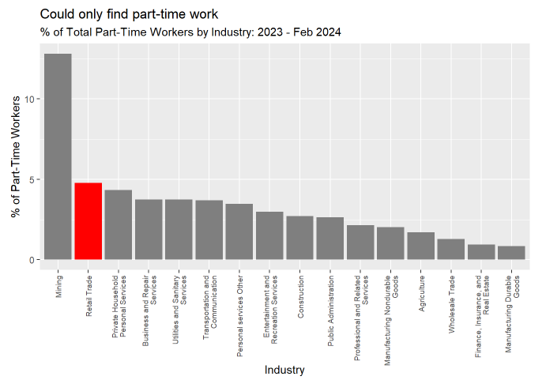

## Synopsis

Over the past year, Retail has maintained a high percentage of workers who are forced to work part time because they could only find part time work. 

Retail also has a higher Job Quit Rate and lower Job Openings Rate.

We have determined that this retail industry practice of hiring part time workers and then choosing to hire more part time workers rather than increasing the work hours of existing staff is not new.

This practice is insidious because it subjects workers to dynamic schedules which confounds a worker’s ability to manage caring for family or scheduling a second job.

Think tanks and State legislatures offer ideas that could be expanded to the federal level. Case in point is the report [“Still falling short on hours and pay. Part-time work becoming [the] new normal”](https://www.epi.org/publication/still-falling-short-on-hours-and-pay-part-time-work-becoming-new-normal/) from the Economic Policy Institute by Lonnie Golden published on December 5, 2016. 

## ["Group 1 Video Presentation"](https://drive.google.com/file/d/1vVVbSTDefejRwU3CMTCPHvvJboUxsJWc/view?usp=drive_link/)

## Introduction

Welcome to Group 1’s Course Project for ADEC 7900 Software Tools for Data Analysis.

Over several weeks we considered various research project ideas, each playing 
to our strengths, reading, finding potential data sources, and corresponding with
potential resources.

By consensus we determined that the best research project topic with the
greatest potential for available data would be to address *a policy maker
working on underemployment and its impact on the economic welfare of
their constituents.*

Our lead question came from ["It’s Not Just Wages. Retailers Are
Mistreating Workers in a More Insidious Way."](https://www.nytimes.com/2024/02/19/opinion/part-time-workers-usa.html) Feb. 19, 2024 By Adelle
Waldman. Ms. Waldman’s forthcoming novel, “Help Wanted,” takes place in a big-box
store.

In her New York Times column, Waldman writes, "Many people choose to work part time for better work-life balance or to attend school or to care for children or other family members. But many don’t. In recent years, part time work has become the default at many large chain employers, an involuntary status imposed on large numbers of their lowest-level employees."

## Data Summary
Our industry analysis is based on a subset of monthly U.S. Census Current Population Survey (CPS) data, which includes year, month, industry and employment status information. Here are the specific economic variables we used: 
* WHYPTLWK: Reason for working part time last week
	* The WHYPTLWK census variable provides detailed reasons for part-time work. Our research focused on isolating code #60 "Could only find part-time work." This is a subgroup of a classification often referred to as “Part-Time for Economic Reasons.”
   * For context, examples of other WHYPTLWK codes include:
      * Material shortage
      * Seasonal work
      * Not want full time work
      * Retired/SS limit on earnings
      * Child care problems
      * Health/medical limitation
      * Too busy with house, school, etc
      * School/training
* WKSTAT: Full or part-time status
* IND1950: Industry classification codes, which are comparable over time
	* The detailed industry codes were grouped by header industries, following the data definitions provided by [IPUMS.org](https://cps.ipums.org/cps-action/variables/IND1950#codes_section).
* WTFINL: The sample weight for each survey respondent
	* Example: A WTFINL value of 2469 means the survey respondent is representative of 2469 Americans.

The CPS data was extracted from [IPUMS.org](https://cps.ipums.org/cps/) with a timeframe of 2005 - February 2024. The IPUMS Data was processed in the "Dan's Analysis in R.Rmd" file. This requires the Data_Tables/cps_00001.xml and cps_00001.dat.gz files to be in the working project directory. A pointer url to the very large cps_00001.dat.gz file is stored under Data_Tables/cps_00001.md.

To determine if the wages paid to retail workers have kept pace with inflation, we also compared wages in retail to their real wage value and purchasing power. We did our own analysis of average real wages using Federal Reserve Economic Data on the [average wage for retail workers](https://fred.stlouisfed.org/series/CES4200000003) and the [consumer price index](https://fred.stlouisfed.org/series/CPIAUCSL) for the corresponding year and a manual calculation to adjust for inflation. The calculation we used was Real Wage in a year = (Nominal Wage in a Year/CPI in a Year)x100. To view the R analysis, please see RealWageMD.Rmd in the repository

### Additional Data
We used additional data provided by the Bureau of Labor Statistics, Federal Reserve Economic Data (FRED), and KFF (an independent provider of health policy research, polling, and journalism) to assess the impact of policies. Information on the variables used and results are provided below. No manual calculations were used with this data. 

## Data Analytics
If an industry has a higher proportion of part time vs. full-time laborers, then they will probably demonstrate a higher proportion of involuntary part time workers, which doesn't provide a meaningful insight. To confirm whether retail has a higher rate of part time workers, we examined the percentage of involuntary part time workers as a percentage of total part time workers rather than as a percentage of total workers in an industry. Our approach gave us a measure of involuntary part time work relative to total part time workers. This compared the "could only find" crowd to the entire "seasonal, vacation, school, sniffles, family care, don't feel like it" crowd across all industries.

This Time Series plot shows the retail industry generally sustains a higher level of workers who can only find part-time work. The following plot zooms in on retail.

Compiling this timeframe's data into a comparative barplot  shows the retail industry is a national leader in this classification of involuntary part time work. This finding provides a strong foundation for Waldman's claim. 

While the retail industry dominates the category “Could only find part time employment” as a “Percent of Part time workers” for the 20 year period 2005 - 2024, it is second only to “Mining” for the most recent period from 2023 to 2024.

Data compiled by United For ALICE, a grassroots movement that conducts research to determine meaningful data regarding households that meet criteria for designation as Asset Limited, Income Constrained, Employed (ALICE). This data shows the U.S. Retail Industry has a high percentage of workers who do not attain a threshold of Economic Viability. This measure of viability includes people living below the Federal Poverty Line (FPL) in addition to folks with income above the FPL but below the cost of basics. The phenomenon of involuntary part-time employment likely contributes to this problem, and is a [potential blind spot in current public policy.](https://www.unitedforalice.org/alice-evd) For example, according to [Economic Policy Institute Research Associate Lonnie Golden, Ph.D.](https://www.epi.org/publication/still-falling-short-on-hours-and-pay-part-time-work-becoming-new-normal/#epi-toc-17), a 2015 Rutgers University survey of almost 1,000 part-time workers found "seven in 10 of involuntary part-time workers say they earn less money than they need to survive and support families.”

Overall, 47% of people below the ALICE threshold work part-time. The retail Industry leads the ALICE rankings with the highest number of workers below the ALICE threshold with 5,645,233. With our estimation of 415,690 involuntary part time U.S. retail workers in December 2023, this means up to 415,690/5,645,233 = 7.36% of this population could be explained by the "Waldman Effect." Definitely a starting point for public policy scrutiny aimed at shaving a few percentage points off this figure of economic inviability.

### How long has this been going on?
Per data from the [Federal Reserve Economic Data (FRED) between 2005-2024](https://fred.stlouisfed.org/series/U6RATE), the percentage of part time workers who can only find part time work fluctuates similarly across most industries. The Retail Industry appears to sustain a higher level of workers who can only find part time work.

### A VERY BRIEF HISTORY of US Labor Policy 

Based on our analysis and additional data found, the retail industry does appear to be hiring part time workers in a manner that prevents employees from obtaining benefits or a predictable schedule which in return, affects quality of life. To determine how this could be changed we reviewed US legislation that aimed to provide benefits which improved the quality of life for citizens. The US has a long history of entrepreneurship and an equally long history of legislation favoring business and property owners over labor.
From the earliest indentured servants and slaves, through 19th century post civil war enforced labor during incarceration, 20th century deadly suppression of labor unions, and the current state of lobbying by businesses and their representatives.

Effective January 10, 2024, the U.S. Department of Labor modified Wage and Hour Division regulations to replace its analysis for determining employee or independent contractor classification under the Fair Labor Standards Act with an analysis that is more consistent with judicial precedent and the Act's text and purpose.

“Over the 20th century, federal law created minimum social and economic rights, and encouraged state laws to go beyond the minimum to favor employees.
The Fair Labor Standards Act of 1938 requires a federal minimum wage, currently $7.25 but higher in 29 states and D.C., and discourages working weeks over 40 hours through time-and-a-half overtime pay. 
There are no federal laws, and few state laws, requiring paid holidays or paid family leave. 
The Family and Medical Leave Act of 1993 creates a limited right to 12 weeks of unpaid leave from larger employers. 
There is no automatic right to an occupational pension beyond federally guaranteed Social Security,
but the Employee Retirement Income Security Act of 1974 requires standards of prudent management and good governance if employers agree to provide pensions, health plans or other benefits. 
The Occupational Safety and Health Act of 1970 requires employees have a safe system of work.”

The act establishing the Department of Labor was signed on March 4, 1913, by a reluctant President William Howard Taft, the defeated and departing incumbent, just hours before Woodrow Wilson took office. A Federal Department of Labor was the direct product of a half-century campaign by organized labor for a "Voice in the Cabinet," and an indirect product of the Progressive Movement. In the words of the original act, the DOL's purpose is "to foster, promote and develop the welfare of working people, to improve their working conditions, and to enhance their opportunities for profitable employment."

The most recent piece of legislation from the [Department of Labor under the Fair Labor Standards Act](https://www.federalregister.gov/documents/2024/01/10/2024-00067/employee-or-independent-contractor-classification-under-the-fair-labor-standards-act) replaces the analysis for determining employee or independent contractor classification under the Fair Labor Standards Act (FLSA or Act) with an analysis that is more consistent with judicial precedent and the Act's text and purpose.

### FMLA

The Family and Medical Leave Act (FMLA) covers only larger employers with at least 50 employees. 
And, it covers only employees who meet these three requirements:

* You must have worked for your employer for at least a year.
* You must work at a location that has at least 50 of your company's employees within a 75-mile radius.
* You must have worked at least 1,250 hours during the 12 months immediately before you take leave.

The act provides employees who meet these requirements with up to 12 weeks of unpaid, job-protected leave per year. FMLA was passed in 1993. 

To analyze the impact of FMLA, we used data from the U.S. Bureau of Labor Statistics regarding access to family leave for employees. Because consistent data was not provide before and after the FMLA was passed, we reviewed data on the incidence of unpaid maternity leave and incidence of unpaid paternity leave from 1988 to 1993 and contrasted it with data on the percent of workers with availability to family leave from 1994 to 1998 and the percent of workers with access to paid family leave benefits between 2014 and 2023. Note that this data provides information on employees' eligibility for these benefits, not the rate at which they were used. 

Per our analysis, the percentage of employees with access to unpaid family leave was 84% in 1995 and has only increased five percentage points since then. 
Access to paid family leave, however, has grown from 2% in 1995 to 27% in 2023. 

Similar data was not found for years prior to 1993, however, the Bureau of Labor Statistics did provide the percent of private industry workers in medium and large establishments participating in unpaid leave benefits. 
This data showed that percent of workers using unpaid maternity leave increased from 33% in 1988 to 60% in 1993 and an even larger increase was seen for workers using unpaid paternity leave as the percentage increased from 16% to 53% in the same years.
The impact could be socially driven, but it does appear that in the years following the FLMA act, most employees have had access to unpaid family leave.

### PTO
In the absence of an applicable state or local law, it's up to the employer to decide whether their part-time employees receive paid time off (PTO) or vacation time, and if so, how much.
We used data on access to PTO published by the Bureau of Labor statistics. The data was manually compiled by reviewing the Employee Benefits summaries published each year and removing areas with null values. The resulting graph reports rates of PTO for all employees from 1998 to 2023 and shows that access to paid sick leave has had the most significant increase among the three categories while access to paid holidays has a slight increase between 1998 and 2023 and access to paid vacations has remained almost unchanged. All three categories report that since 1998, most employees have had access to paid leave, indicating that even without legislation, the benefit has been provided by employers. 

### Real Wage Value and Purchasing Power
To determine if the wages paid to retail workers have kept pace with inflation, we also compared wages in retail to their real wage value and purchasing power. 

According to the Bureau of Labor Statistics May 2023, Retail Salespersons average wage is $36,690.00 (category 41-2031). Whereas according to the Census Bureau, "Cashiers (category 41-2011) were among the lowest-paid members of the retail workforce. In 2023, their median earnings ($30,710) were around 47% less than those of all full-time, year-round workers ($57,216)."

We did our own analysis of average real wages using Federal Reserve Economic Data on the average wage for retail workers and the consumer price index for the corresponding year and a manual calculation to adjust for inflation. The calculation we used was Real Wage in a year = (Nominal Wage in a Year/CPI in a Year)x100

Per our results, real wages for retailers appear to have decreased from around 2006 to 2011 and then began increasing until the COVID-19 Pandemic beginning in 2020.

The Fair Labor and Standards Act provides additional requirements for companies to further establish employee protections. The act specifically establishes minimum wage, overtime pay, recordkeeping, and youth employment standards. 

Per data from FRED the average hourly earnings of all employees in retail trade had only minor increases between 2007 and 2009 when the minimum wage was increased three times. Starting in 2010, the average wage for employees in retail has increased more dramatically. Since the last increase in the federal minimum wage was on July 24, 2009, this analysis indicates that minimum wage laws may have less of an effect on the hourly wage for retail employees than other sources. 

For our purposes in deciding whether or not to establish a policy requiring a minimum percentage of full-time employees, analysis of minimum wages suggests policy would not be the driving force behind significant change in employer hiring practices.

### Health Care
Similarly, when determining if trends in PT are voluntary or forced, we can look at other quality of life indicators. 

Here we compare health care insurance coverage by type. Notice that “non-group” reports insurance purchased independently rather than through an employer's group coverage. It includes the Affordable Health Care marketplace for ACA health insurance coverage and the data was provided by KFF, an independent provider of health policy research, polling, and journalism.

The Patient Protection and Affordable Care Act (ACA) became law on March 23, 2010 and since then, the quantity of uninsured individuals has decreased, while the quantity of those insured by Medicaid and Medicare have mostly trended upward (the trend in medicare however may be due more to an aging population rather than any change in policy). Additionally, since 2010, the percentage of people insured through their employer has decreased while the percentage receiving insurance independently (or the “non-group population") remained relatively consistent.

Since the goal of the ACA was to allow access to healthcare for all Americans, a reduction in the number of uninsured individuals as well as a continued trend in this direction since 2010 signifies a possible potential impact. 

Our analysis for all policy comparisons mentioned do not however account for any possible correlations in data and no statistical significance calculation was made. Further analysis could be completed with more data, time, and research to determine if the policies are statistically significant or if changes were more likely to have occurred due to an outside source. 

### Employer Practices - recent history

1. Every CEO in office will have read one of the Harvard Business Review’s succession planning [Case Studies](https://www.federalregister.gov/documents/2024/01/10/2024-00067/employee-or-independent-contractor-classification-under-the-fair-labor-standards-act) and understands the UMass Global article ["How promoting from within could benefit your business](https://www.umassglobal.edu/news-and-events/blog/promoting-from-within)
   
* Promoting from within can save time and money
* Internal mobility can help with retention and motivation
* There’s less risk involved with internal promotions. Creating a pipeline for full time store personnel to join the executive training program should be cost effective. It could also generate a good public relations opportunity.

2. Some of the biggest retailers have offered tuition reimbursement and better work schedules including consistency and full-time schedules, and then withdrawn those benefits.

3. According to the BLS many retail jobs do not pay a living wage. 
Our analysis of data from IPUMS.org has found that retail consistently sustains a higher level of part-time workers when compared with other sectors. [IPUMS](https://cps.ipums.org/cps/) is a part of the Institute for Social Research and Data Innovation at the University of Minnesota and is directed by Regents Professor Steven Ruggles. 

## Economic welfare of constituents

Our stated objective is to address a policy maker working on *underemployment and its impact on the economic welfare* of their constituents. Our analysis estimated 415,690 involuntary part-time U.S. retail workers in December 2023. The "Waldman Effect" could explain up to 7.36% of involuntary retail workers’ jobs. Definitely a starting point for public policy scrutiny aimed at shaving a few percentage points off this figure of economic inviability.

Although the initial furor over the potential impact on employers of the ACA has not created the feared changes to numbers of employees, nor to the number of hours employees worked, advancing technology is making it easier for employers to identify scheduling needs resulting in last minute changes to employee schedules. 

Technology is not going away and AI will continue to impact work, so finding a way to reduce or eliminate irregular schedules is central to addressing what has become the default at many large chain employers; involuntary part-time employment.

Over the past year, Retail has maintained a high percentage of workers who are forced to work part-time because they could only find part-time work. 

Retail also has a higher Job Quit Rate and lower Job Openings Rate.

McKinsey Frontline Retail Great Attrition and Great Attraction Survey, April 2022, https://www.mckinsey.com/industries/retail/our-insights/how-retailers-can-attract-and-retain-frontline-talent-amid-the-great-attrition  offers a dozen reasons why retail employees are quitting and suggests four imperatives:
* Understand your frontline talent pools and build a distinctive employee value proposition. 
* Innovate to offer differentiated flexibility.
* Simplify frontline retail jobs and make them more engaging. 
* Invest to build strong managers and a development culture.

## Conclusion

[The US Census Bureau](https://www.census.gov/library/stories/2023/12/holiday-retail-workers.html#:~:text=In%202022%2C%20their%20median%20earnings,2010%20to%205.6%25%20in%202022) reports that “the relative number of U.S. retail workers remained over 9 million, but their share of the total workforce fell from 6.9% in 2010 to 5.6% in 2022.”

* In 2023-2024 data Retail represents 5% of all part-time labor which is down from 8% for 2005-2024 
* Part-time labor in retail peaked between 2008 and 2015 when it remained above 10% and visited 13% repeatedly. 
* Part-time labor dropped below 5% in 2020, presumably when COVID shut down many in person shopping venues.
* Part-time retail labor has hovered around 5% of total labor since 2020.
* December 2023, up to 7.36% of retail labor is involuntarily part-time representing the “Waldman Effect”

Northeastern Professor Dennis R. Shaughnessy corrects the oft misquoted  “The business of America is business!”   [Actually, President Coolidge said](https://www.northeastern.edu/sei/2017/02/the-business-of-america-is-business/) that the “chief business of the American people is business.”  

It appears then that the original idea behind Coolidge’s idea was indeed to praise business leaders and the business community for driving the economic prosperity of America and its people. But it also appears that he did not believe that business alone, or self-interest and wealth accumulation, are what drives Americans and our society forward. Rather, it is the higher ideals such as peace, honor and charity that make up the core of American values. 

As Professor Shaughnessy reflects back on the words of President Coolidge, President Reagan and President Trump, we agree with his hopes that the idea of being “pro-business” is not interpreted narrowly to require a diminishment of social commitments. 

We have determined that this retail industry practice of hiring part-time workers and then choosing to hire more part-time workers rather than increasing the work hours of existing staff is not new. 

This practice is insidious because it subjects workers to dynamic schedules which confounds a worker’s ability to manage caring for family or scheduling a second job.

Think tanks and State legislatures offer ideas that could be expanded to the federal level. 
Case in point is [the report](https://www.epi.org/publication/still-falling-short-on-hours-and-pay-part-time-work-becoming-new-normal/) “Still falling short on hours and pay. Part-time work becoming [the] new normal” from the Economic Policy Institute by Lonnie Golden published on December 5, 2016. 

## Policy Recommendation
One policy highlighted by Golden is a San Jose city ordinance that "requires San Jose employers to offer newly available working hours to qualified part-time employees before hiring more part-time staff or temporary employees." The policy [went into effect in 2017](https://www.shrm.org/topics-tools/employment-law-compliance/complying-san-joses-minimum-wage-opportunity-to-work-ordinance).
Our recommendation is to adopt the San Jose, CA 2017 policy because it has a proven track record and would be consistent with a future update to federal tax code reversing rules regarding exclusion of part-timers from many types of benefits, which currently make it attractive for employers to hire more part-time than full-time employees if benefits are increasing in cost more than wage compensation. 

[(see Lambert, Fugiel, and Henly 2014)](https://cpb-us-w2.wpmucdn.com/voices.uchicago.edu/dist/5/1068/files/2018/05/managingprecariousworkschedules_11.11.2015-qmnh8j.pdf) 
[(Alexander and Haley-Lock 2015)](https://onlinelibrary.wiley.com/doi/abs/10.1111/irel.12111).

Finally, if these incremental changes are insufficient to alleviate the burden of involuntary part-time hours, then it might be time for Congress to act with legislation requiring all workers receive all benefits prorated to reflect the differences in hours worked. “This would reduce the number of Americans working in involuntary part-time positions, as employers would no longer stand to gain as much from employing part-time workers (Tilly 1990).” [https://pages.ucsd.edu/~bslantchev/courses/ps240/06%20Domestic%20Organizations%20and%20International%20Behavior/Tilly%20-%20Coercion,%20capital%20and%20European%20states%20[Ch%201,3,6].pdf
](https://www.jstor.org/stable/44582194)
